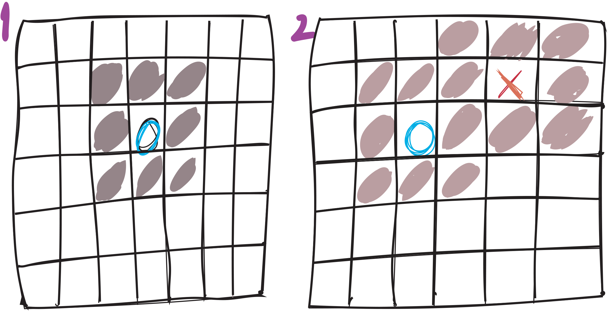
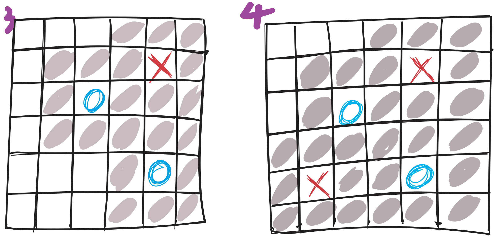
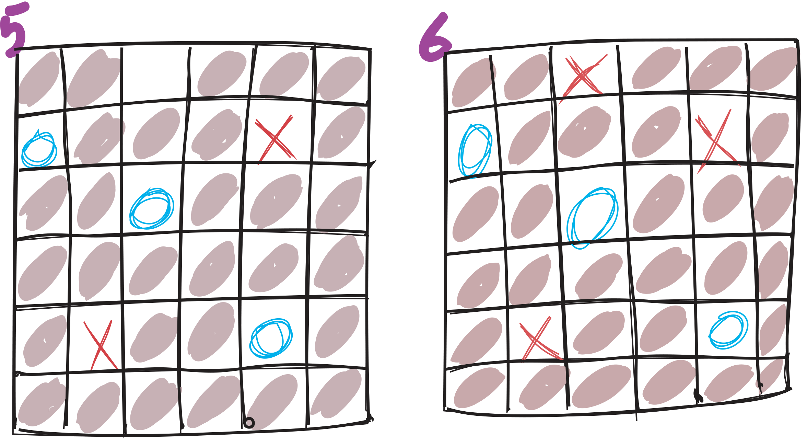

## Welcome to Obstruction Help Pages

> Assignment Manual (recommended features included but not required)
<object data="https://github.com/aiegoo/obstruction/blob/master/50.CPP_app.pdf" type="application/pdf" width="700px" height="700px">
    <embed src="https://github.com/aiegoo/obstruction/blob/master/50.CPP_app.pdf">
        <p>This browser does not support PDFs. Please download the PDF to view it: <a href="50.CPP_app.pdf">Download PDF</a>.</p>
    </embed>
</object>

[assignment](https://eggs.or.kr/crh/drone_resource/-/blob/8a8c0dbcb7c50f0f5b7541e4c7125fab2ec93437/50.CPP_app.pdf)
You can use the [editor on GitHub](https://github.com/aiegoo/obstruction/edit/master/README.md) to preview the source and offer your ideas through the pull request, which I would welcome with wide open arms.

Whenever you are done with one version of Obstruction, you can choose another Tag from the branches marked Tag and sequential version numbers, which will run [youtube](https//youtube.com:xkdyk??) to rebuild the pages in your site, from the content in your choice of version files.

### obstruction

Obstruction is a territory game to play against each other in order to obsruct the opponent to dominate the world of the game board.

```markdown
Here is the key rules of the game

# rule 1
## rule 2
### rule 3

- Bulleted
- List

1. Numbered
2. List

**Player** and _Opponent_ and `Territory` wqar

[Link](url) and 
```
### winning strategy

<table border="1">
<tbody><tr align="center" height="20"><td bgcolor="#cccccc" width="20">&nbsp;</td><td bgcolor="#cccccc" width="20">&nbsp;</td><td bgcolor="#cccccc" width="20">&nbsp;</td><td bgcolor="#cccccc" width="20">&nbsp;</td><td width="20">O</td></tr>
<tr align="center" height="20"><td bgcolor="#cccccc">&nbsp;</td><td>X</td><td bgcolor="#cccccc">&nbsp;</td><td bgcolor="#cccccc">&nbsp;</td><td bgcolor="#cccccc">&nbsp;</td></tr>
<tr align="center" height="20"><td bgcolor="#cccccc">&nbsp;</td><td bgcolor="#cccccc">&nbsp;</td><td bgcolor="#cccccc">&nbsp;</td><td bgcolor="#cccccc">&nbsp;</td><td>O</td></tr>
<tr align="center" height="20"><td>&nbsp;</td><td>&nbsp;</td><td>&nbsp;</td><td bgcolor="#cccccc">&nbsp;</td><td bgcolor="#cccccc">&nbsp;</td></tr>
<tr align="center" height="20"><td>&nbsp;</td><td>&nbsp;</td><td>&nbsp;</td><td bgcolor="#cccccc">&nbsp;</td><td>X</td></tr>
</tbody></table>


For more details see [blog](http://www.papg.com/show?2XMX).

### Jekyll Themes

You can select styles for dark and light console color.
[repository settings](https://github.com/aiegoo/obstruction/settings). The name of this theme is saved in the Jekyll `_config.yml` configuration file.

### Support or Contact

Having trouble with running Obstruction? Check out our [Game Center](aiegoo.github.io/obstruction) or [contact support](https://36io.co) and we’ll help you sort it out.

`TL;DR`

### dEvelopment story
[project management](https://github.com/aiegoo/cplus/projects/1) 
- Solo Flight and my view on C++
<p style="text-align: center">
I hate C++ as I rarely liked the language specific programmers. They are rare in numbers and <br>alas an odd sorts in characters too. But then it has been some paramount challenge, as untasteful as ever for me <br>to dive into the school of programmers as a student, notwithstanding becoming one, I admit. <br>I still have the reservation to start on this path, but who knows the future? <br>as I always believe in 'divde and conquer'.
</p>
### Game process
The first player should hit 'o' on keyboard while 'x' for the 2nd player.


<hr>


<hr>


